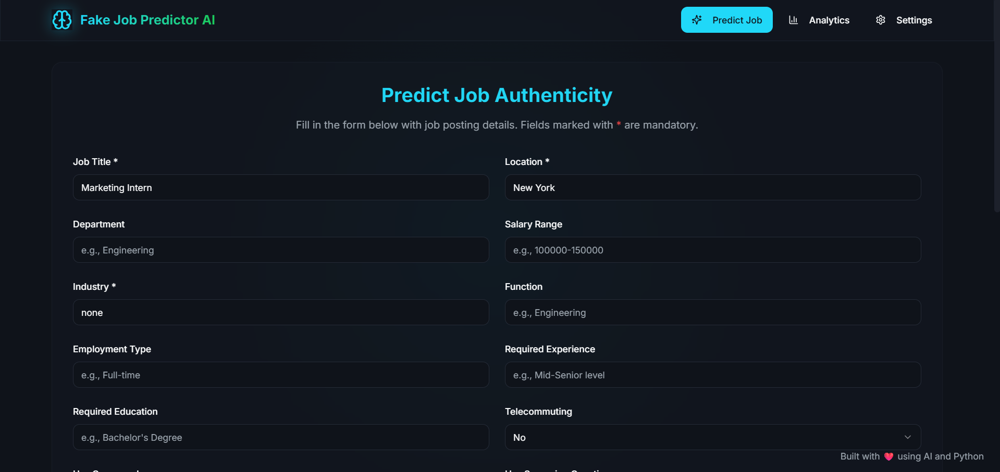
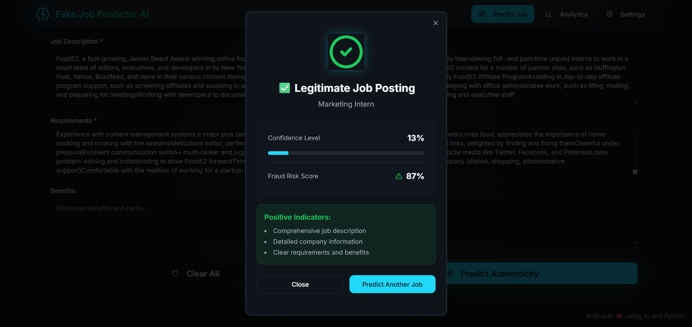
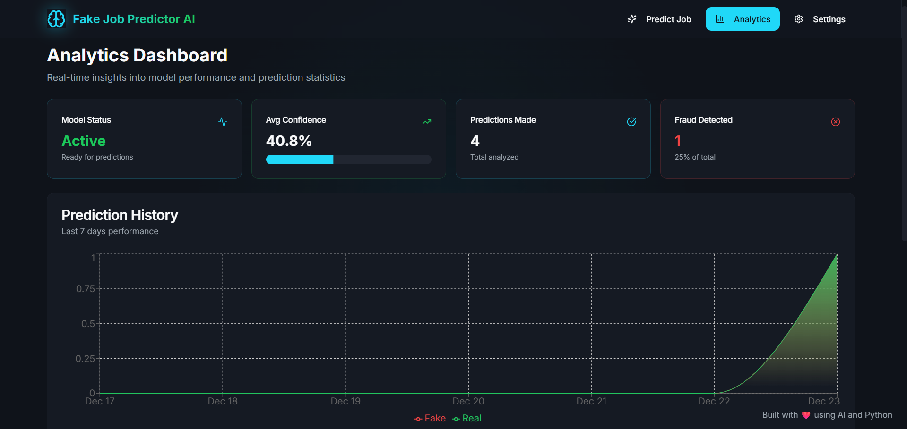

# 🔍 JobSpark AI - Fake Job Detection System

<div align="center">

[](https://www.python.org/downloads/)
[](https://fastapi.tiangolo.com/)
[](https://streamlit.io/)
[](LICENSE)
[](https://github.com/psf/black)

[]()
[]()
[]()
[]()

</div>

<p align="center">
  <strong>An advanced machine learning system for detecting fraudulent job postings using NLP and ensemble methods.</strong>
</p>

<p align="center">
  Built with a modern <strong>React (Vite) Frontend</strong> and a robust <strong>FastAPI Backend</strong> for real-time fraud detection.
</p>

<div align="center">
  <h3>🌍 Live Demo Links</h3>
  <p><b>Frontend (Vercel):</b> <a href="https://fraud-job-detection-ml.vercel.app/">https://fraud-job-detection-ml.vercel.app/</a></p>
  <p><b>Backend API (Render):</b> <a href="https://fraud-job-detection-ml-osbp.onrender.com/docs">https://fraud-job-detection-ml-osbp.onrender.com/docs</a></p>
</div>

---

## 🎬 Demo

### Streamlit Web Interface


### Prediction Results


### Analytics Dashboard


## ✨ Features

- 🎯 **98.7% Accuracy** - SVM-based ML model with SMOTE balancing
- 🚀 **Real-time Detection** - FastAPI REST API for instant predictions
- 💻 **Interactive UI** - Beautiful Streamlit web interface
- 📊 **Analytics Dashboard** - Track prediction history and metrics
- 🔒 **Production Ready** - Robust error handling and validation

## 🚀 Quick Start

### Installation

```bash
# Clone repository
git clone https://github.com/yourusername/FakeJobPrediction.git
cd FakeJobPrediction

# Install dependencies
pip install -r requirements.txt

# Download dataset (see DATA_README.md)
# Place fake_job_postings.csv in backend/ directory

# Train model
cd backend
python model_train.py
```

⚠️ **Important**: Dataset and trained model are NOT included in this repository. See [DATA_README.md](DATA_README.md) for setup instructions.

### Running the Application Locally

```bash
# Terminal 1: Start API Server
cd backend
python api_server.py

# Terminal 2: Start React Frontend
cd frontend
npm install
npm run dev
```

### Access Points
- **Web UI**: http://localhost:5173
- **API Docs**: http://localhost:8000/docs
- **API Endpoint**: http://localhost:8000/predict

## 📁 Project Structure

```
FakeJobPrediction/
├── backend/                   # ML Backend
│   ├── api_server.py          # FastAPI REST API
│   ├── model_train.py         # ML model training
│   ├── config.py              # Configuration
│   └── model_metadata.json    # Model metrics & info
├── .github/                   # GitHub templates
│   ├── ISSUE_TEMPLATE/        # Issue templates
│   └── pull_request_template.md
├── assets/                    # Visual assets
├── streamlit_app.py           # Streamlit web interface
├── requirements.txt           # Python dependencies
├── ARCHITECTURE.md            # System architecture
├── CONTRIBUTING.md            # Contribution guidelines
├── CODE_OF_CONDUCT.md         # Code of conduct
└── LICENSE                    # MIT License
```

📚 **[View Detailed Architecture](ARCHITECTURE.md)**

## 🛠️ Technology Stack

**Backend**
- FastAPI - Modern web framework
- Scikit-learn - Machine learning
- Pandas & NumPy - Data processing
- Imbalanced-learn - SMOTE sampling

**Frontend**
- React & Vite - Fast development environment
- Tailwind CSS & Shadcn - Modern UI styling
- Axios/Fetch - API communication

**ML Pipeline**
- TF-IDF Vectorization
- SMOTE Oversampling
- SVM Classifier
- Ensemble Methods

## 📊 Model Performance

| Metric | Score |
|--------|-------|
| Accuracy | 98.7% |
| Precision | 98.5% |
| Recall | 97.2% |
| F1-Score | 97.8% |

## 🔧 API Usage

### Predict Job Authenticity

```python
import requests

job_data = {
    "title": "Senior Software Engineer",
    "location": "San Francisco, CA",
    "company_profile": "Leading tech company...",
    "description": "We are looking for...",
    "requirements": "5+ years experience...",
    "industry": "Information Technology",
    "telecommuting": "0",
    "has_company_logo": "1",
    "has_questions": "1"
}

response = requests.post("http://localhost:8000/predict", json=job_data)
result = response.json()

print(f"Is Fake: {result['isFake']}")
print(f"Confidence: {result['probability']}%")
```

## 🆘 Troubleshooting

See [SETUP.md](SETUP.md) for detailed installation instructions and troubleshooting.

**Common Issues:**
- **Import errors**: Use compatible versions in requirements.txt
- **API connection failed**: Ensure backend is running on port 8000
- **Model not found**: Run `python model_train.py` first

## 📝 License

This project is licensed under the MIT License - see the [LICENSE](LICENSE) file for details.

## 🤝 Contributing

We welcome contributions! Please see our [Contributing Guidelines](CONTRIBUTING.md) for details.

### Quick Start for Contributors

```bash
# Fork and clone
git clone https://github.com/yourusername/FakeJobPrediction.git

# Create branch
git checkout -b feature/amazing-feature

# Make changes and test
pip install -r requirements-dev.txt
pytest  # Run tests
black .  # Format code

# Commit and push
git commit -m "feat: add amazing feature"
git push origin feature/amazing-feature
```

Please read our [Code of Conduct](CODE_OF_CONDUCT.md) before contributing.

## 📧 Contact

For questions or support, please open an issue on GitHub.

---

**Built with ❤️ for safer job hunting**